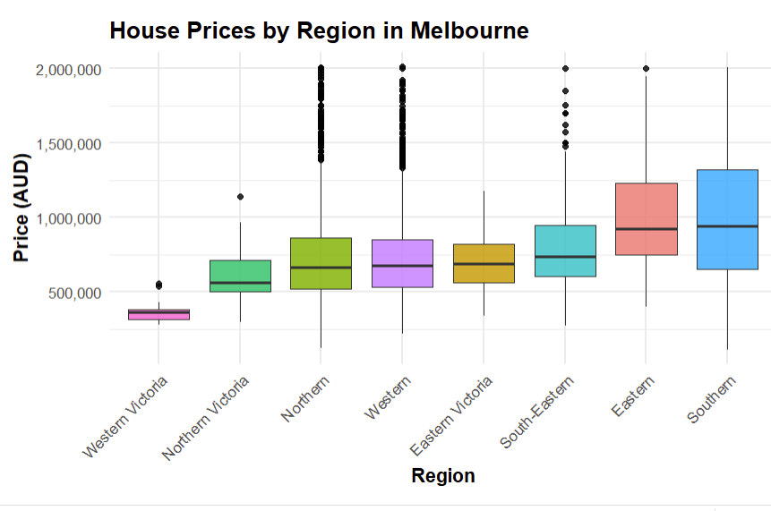
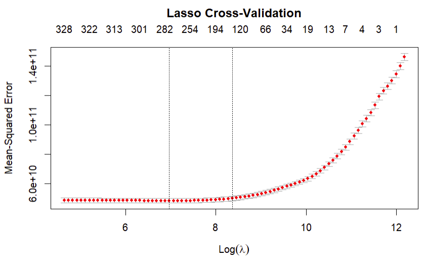

# Melbourne Housing Price Analysis
 
 


📊 Statistical and machine learning analysis of Melbourne housing prices using R.

---

## 📌 Project Overview

This project investigates the key factors that influence housing prices in Melbourne, Australia.
We use statistical modeling and machine learning techniques to analyze property prices, property type differences, and regional variations.

---

## 🔍 Key Research Questions:

- Does location significantly affect housing prices?

- Do room counts and property type impact prices?

- Can we accurately predict house prices using a regression model?

- Do different regions of Melbourne exhibit significant price differences?

- How does property type (house, unit, townhouse) relate to selling price?

---

## 🛠 Methods Used

- Exploratory Data Analysis (EDA): Boxplots, histograms, descriptive statistics.

- Multiple Linear Regression (MLR): To assess the impact of location and distance.

- One-Way ANOVA: To test differences in mean housing prices across categorical groups (Region, Property Type).

- Tukey HSD Post-Hoc Test: For pairwise regional comparisons.

- Generalized Linear Model (GLM): To model log-transformed price with multiple predictors.

- Logistic Regression: To classify properties into high-price vs low-price groups.

- Regularization (LASSO): To identify the most influential predictors.

- K-Means Clustering: To segment housing markets by size and price.

---

## 📈 Results Summary

- Region Matters: Significant differences in house prices across Melbourne regions (Southern and Eastern highest; Western Victoria lowest).

- Property Type Matters: Houses sell for more than townhouses and units (confirmed via ANOVA, GLM, and logistic regression).

- Predictors: Number of rooms, distance to CBD, and property type are strong determinants of price.

- Clusters: Housing market can be grouped into 3 main clusters by land size and price.

---

## 📂 Repository Structure
### Tree View
```
melbourne-housing-analysis/
├── FinalReport_github.Rmd # R Markdown source code
├── FinalReport.pdf # Final compiled report
├── Melbourne_housing.csv # Dataset
├── LICENSE # License (MIT)
├── .gitignore # Ignored files config
└── README.md # Project description (this file)
```

### File Descriptions
- [**FinalReport_github.Rmd**](FinalReport_github.Rmd): R Markdown source code with statistical and ML analysis  
- [**FinalReport.pdf**](FinalReport.pdf): Final compiled report (ready-to-read version)  
- [**Melbourne_housing.csv**](Melbourne_housing.csv): Dataset used in the analysis  
- [.gitignore](.gitignore): Files/folders excluded from version control  
- [LICENSE](LICENSE): Open-source license (MIT)  
- [README.md](README.md): Project overview and documentation  

---

## ▶️ How to Reproduce This Project

```bash
git clone https://github.com/your-username/melbourne-housing-analysis.git
cd melbourne-housing-analysis
```
1. Open FinalReport_github.Rmd in RStudio.
2. Install required R packages:
```bash
    install.packages(c("tidyverse", "ggplot2", "glmnet", "car", "broom"))
```
3. Knit the RMarkdown file to generate the PDF report.

---

## 📌 Dataset
The original dataset is publicly available on Kaggle:
[Melbourne Housing Dataset](https://www.kaggle.com/datasets/ronikmalhotra/melbourne-housing-dataset)

---

## 🔑 License

This project is licensed under the MIT License — see the LICENSE file for details.

---

## 📊 Key Plots  

### 1. House Prices by Region  
Shows how housing prices vary significantly across Melbourne’s regions.  
  

### 2. House Prices by Property Type  
Clear differences in prices between houses, townhouses, and units.  
  

### 3. Predicted vs Actual Prices  
Demonstrates the performance of the regression model.  


### 4. LASSO Cross-Validation Curve *(Advanced ML)*  
Highlights the use of regularization and model selection.  
  

---

## 📜 References

Bluman, A. G. (2012). Elementary statistics (10th ed.). McGraw-Hill Education.

Friedman, J., Hastie, T., & Tibshirani, R. (2010). Regularization paths for generalized linear models via coordinate descent. JSS.

Kabacoff, R. I. (2015). R in Action. Manning Publications.

---

## 👤 Author  

**Jose De Leon**  
🎓 Master’s in Analytics Candidate, Northeastern University  
📬 [Email me](mailto:j.angel2294@gmail.com)  
🔗 [LinkedIn](https://www.linkedin.com/in/jose-de-leon-analytics/)

